# 🔐 Identity Lifecycle & Security Monitoring Lab
### Lakeshore Financial (Simulated Environment)

A hands-on lab simulating how a mid-sized financial services company manages user identities and detects access-related security risks using Microsoft Entra ID.

---

## 📌 Overview

This project walks through the full **Joiner–Mover–Leaver (JML)** identity lifecycle inside Microsoft Entra ID, using **Role-Based Access Control (RBAC)** and the principle of **least privilege**. On top of the lifecycle work, the lab also covers the security monitoring side: spotting **privilege creep** during a role change and detecting + responding to an **unauthorized privilege escalation** using audit logs.

**Lakeshore Financial** is a fictional mid-sized financial services company created for this lab.

> ⚠️ **Disclaimer:** This is a simulated lab environment built for learning and portfolio purposes. No real company data, systems, or people were involved.

---

## 🔄 Identity Lifecycle Covered

| Stage | What happens |
|---|---|
| **Joiner** | New hire is onboarded with least-privilege access |
| **Mover** | Employee changes roles → privilege creep is detected and cleaned up |
| **Leaver** | Departing employee is disabled and stripped of access |
| **Incident** | Unauthorized privilege escalation is detected in logs, investigated, and contained |

---

## 🏢 Environment

- **Platform:** Microsoft Entra ID
- **Tenant:** Lakeshore Financial (lab tenant)
- **Access model:** Role-Based Access Control (RBAC) via security groups

---

## 🧱 Architecture

### Departments
- Banking Operations
- Finance & Accounting
- Administration
- IT / Security

### Security Groups

| Group | Purpose |
|---|---|
| BankOps-Analyst | Banking operations analysts – standard access |
| BankOps-Manager | Banking operations managers – elevated access |
| Admin-Staff | Administrative staff – standard access |
| Finance-Accounting | Finance and accounting team – financial systems access |
| IT-HelpDesk | IT support team – account support access |
| IT-Security | Security team – high privilege access |

### Baseline Users

| User | Role | Group |
|---|---|---|
| Carlos Mendez | Banking Ops Analyst | BankOps-Analyst |
| Maria Lopez | Admin Staff | Admin-Staff |
| David Chen | Accountant | Finance-Accounting |
| Alex Rivera | IT Support | IT-HelpDesk |
| Kevin Patel | Security Analyst | IT-Security |
| Test User | Test account | *(none)* |

Baseline environment after setup:

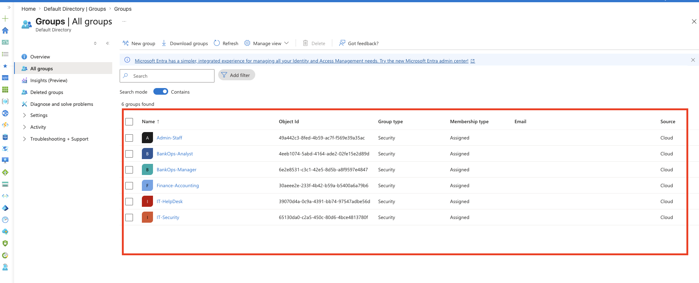
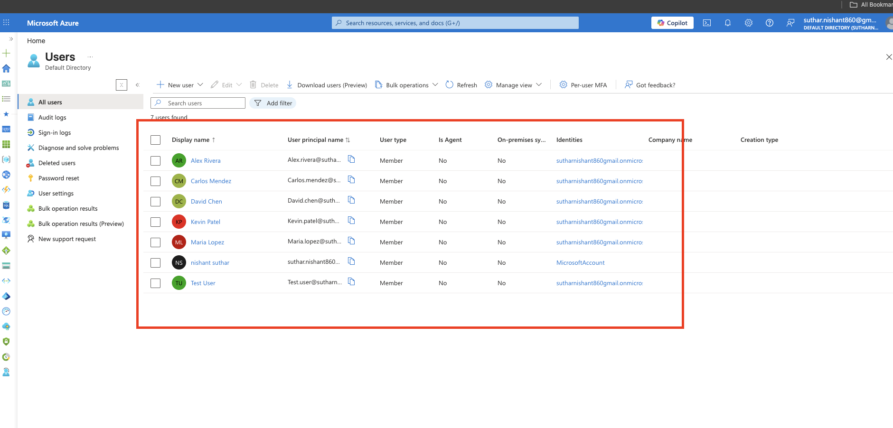
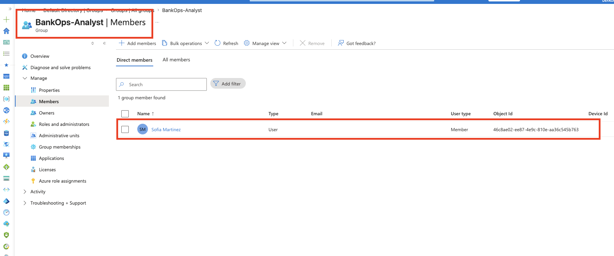

Audit logging was verified before running any scenarios, so every action in this lab has a matching log entry:

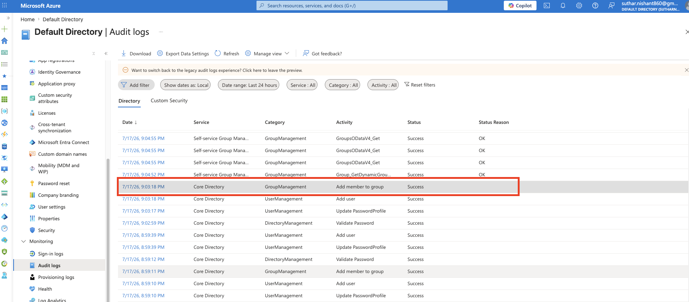
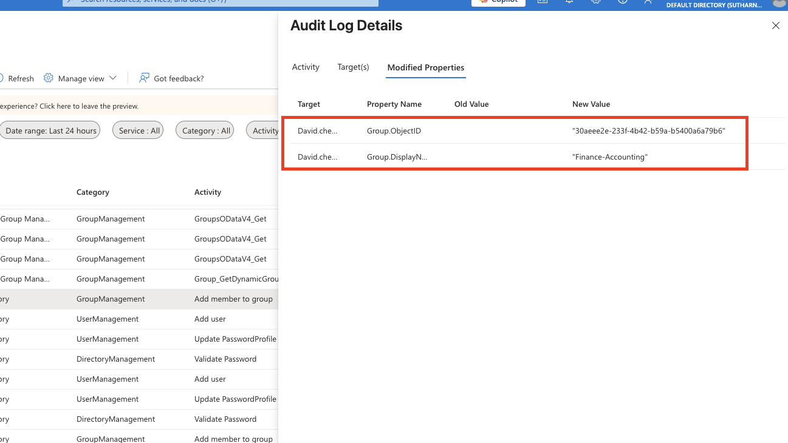

---

## 🟢 Scenario 1 — Joiner (Onboarding)

**Story:** Lakeshore Financial hires a new banking operations analyst, **Sofia Martinez**.

**Goal:** Onboard her following least privilege — she gets exactly the access her role needs and nothing more.

**What I did:**
1. Created the user account `sofia.martinez`
2. Assigned her to the **BankOps-Analyst** group only
3. Verified her group membership and confirmed she belongs to no other groups
4. Confirmed the actions in the audit logs (`Add user`, `Add member to group`)

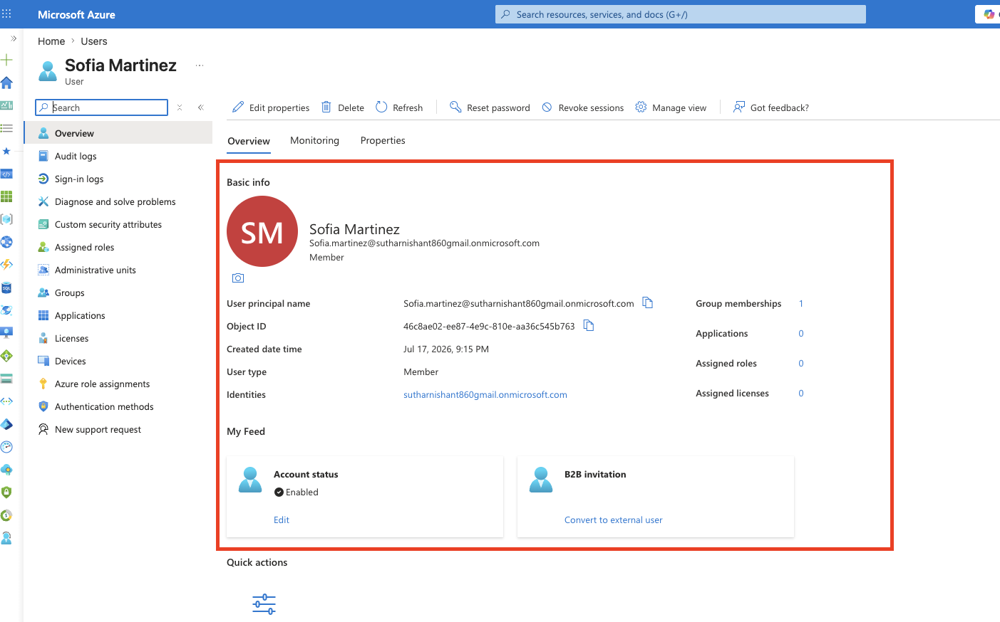
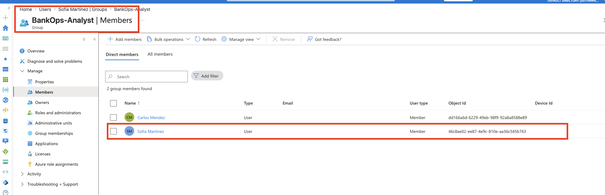
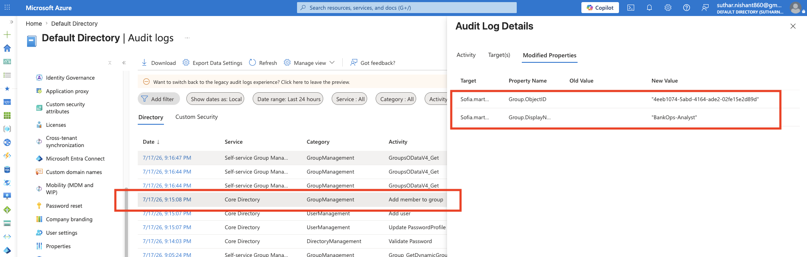

**Why it matters:** Most access sprawl in real companies starts on day one. If onboarding hands out extra access "just in case," every new hire becomes unnecessary attack surface. Clean onboarding keeps the baseline tight.

---

## 🔵 Scenario 2 — Mover (Privilege Creep)

**Story:** Carlos Mendez gets promoted from Analyst to **Manager**. The role change is handled sloppily on purpose to recreate one of the most common real-world IAM failures.

**The mistake (simulated):**
- Carlos was added to **BankOps-Manager**
- His old **BankOps-Analyst** access was *not* removed
- Result: Carlos now holds the access of two roles → **privilege creep**

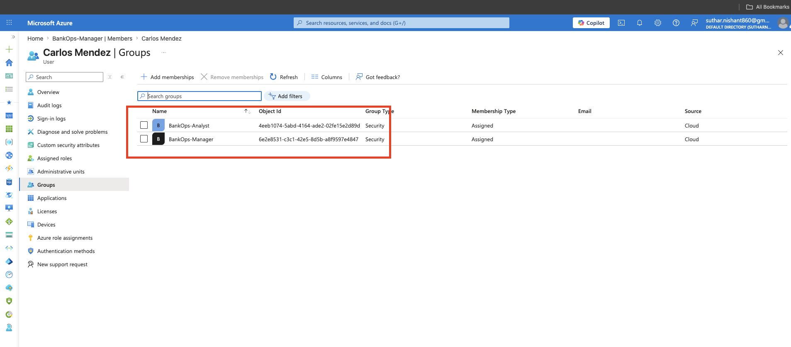

**Detection & remediation:**
- An access review of Carlos's memberships showed access that no longer matched his job
- Removed him from **BankOps-Analyst**, keeping only **BankOps-Manager**
- Verified the fix and confirmed both actions in the audit logs (`Add member to group`, `Remove member from group`)

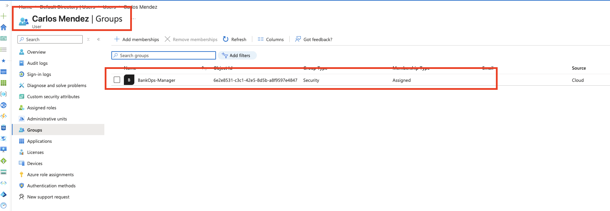
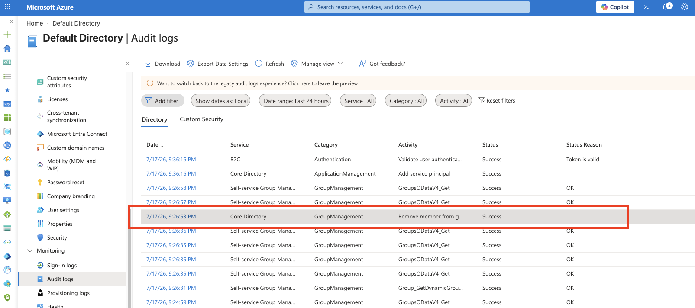

**Why it matters:** As people change roles over the years, they quietly collect access nobody cleans up. A compromised long-tenured account can carry several jobs' worth of permissions, which gives attackers easy lateral movement. Role changes are exactly where this has to be caught.

---

## 🔴 Scenario 3 — Leaver (Offboarding)

**Story:** **Maria Lopez** leaves Lakeshore Financial.

**What I did:**
1. Disabled her account (blocked from sign-in) — the account was **disabled, not deleted**
2. Removed all of her group memberships
3. Verified she has zero remaining access
4. Confirmed the actions in the audit logs

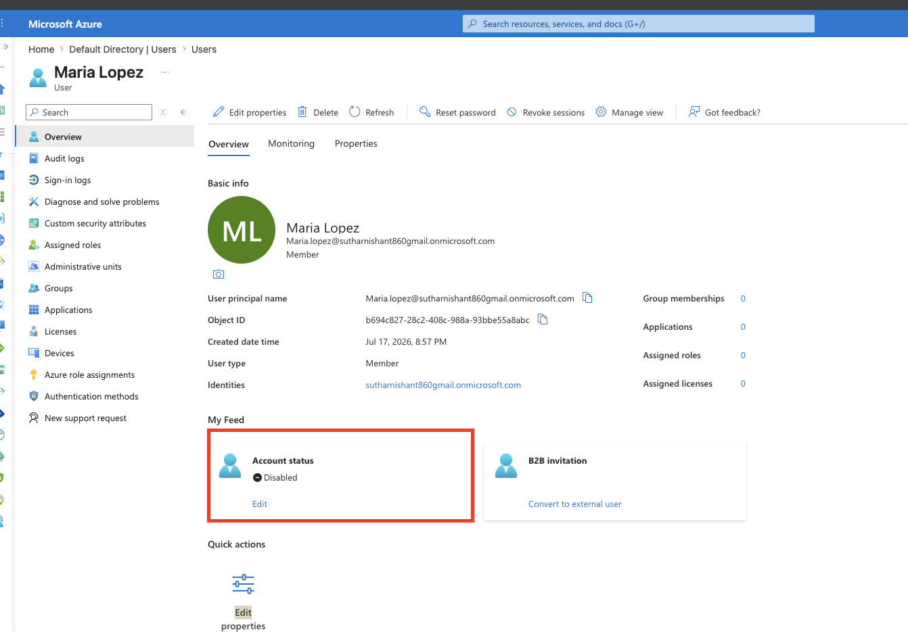
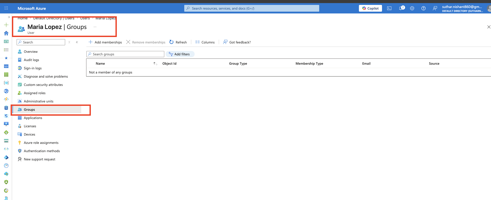
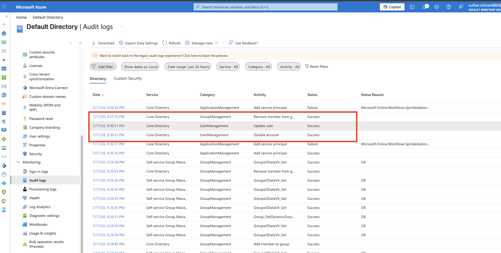

**Why disable instead of delete:** Deleting an account destroys the evidence trail. Keeping the account disabled preserves its logs and history in case a future investigation needs them, while still guaranteeing the account can't be used.

**Why it matters:** Forgotten accounts of ex-employees are a classic breach entry point — the person leaves, the account keeps working, and eventually someone (the ex-employee or an attacker) uses it.

---

## 🚨 Scenario 4 — Security Incident (Privilege Escalation)

**Story:** **Test User** — an account with no job function and no group memberships — suddenly shows up in **IT-Security**, the highest-privilege group in the tenant. No one approved this. This simulates what a compromised account performing privilege escalation looks like.

### Detect
- During a routine review of the audit logs, found an `Add member to group` event adding Test User to **IT-Security**

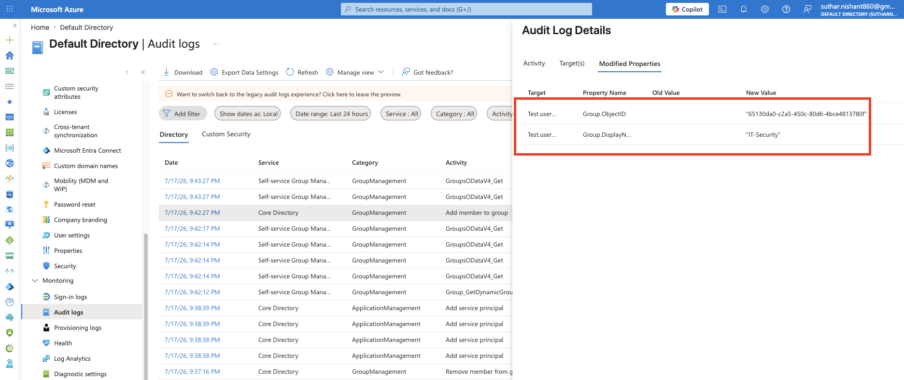

### Investigate
- Checked whether the change had any approval or business justification → it had none
- An unexplained membership change on a high-privilege group is a strong indicator of account compromise → treated as a confirmed incident

### Contain
- Removed Test User from **IT-Security**
- Disabled the Test User account entirely — if an account is adding itself to privileged groups without approval, it has to be assumed compromised, so cutting one group membership isn't enough
- Verified IT-Security membership was back to normal and confirmed all response actions in the audit logs

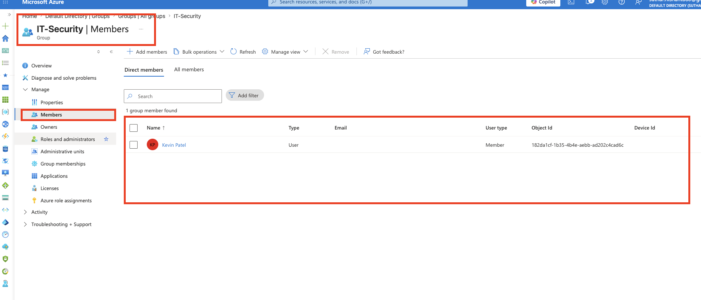
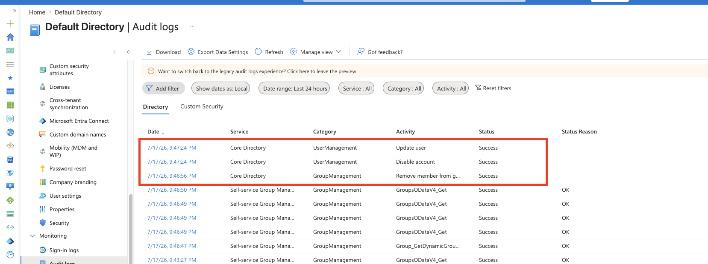

**Why it matters:** Unexpected changes to privileged group membership are one of the top signals SOC teams alert on. Fast detection and containment is the difference between a small incident and a full breach.

---

## 🔍 Logging & Monitoring

Entra ID audit logs were used throughout the lab to track:

- User creation
- Group membership changes
- Account status changes (disable)

Every scenario in this lab is backed by its audit trail, which is what provides **accountability** (who did it), **traceability** (what exactly happened and when), and **detection** (spotting what shouldn't have happened).

---

## 🧠 Key Takeaways

- Identity is one of the biggest attack surfaces in modern environments — most breaches involve a compromised account, not a hacked firewall
- RBAC + least privilege keeps access manageable and keeps the blast radius of any single compromised account small
- Privilege creep builds up silently during role changes and has to be actively caught, not assumed away
- Offboarding is a security control: disable, strip access, preserve the account for forensics
- Audit logs are only useful if someone actually reviews them — detection is a habit, not a feature

---

## 🚀 Future Improvements

- Automate the Joiner/Mover/Leaver workflows with **Microsoft Graph PowerShell** scripts
- Set up **alerting** on privileged group membership changes instead of relying on manual log review
- Forward logs to a SIEM (**Microsoft Sentinel**) for centralized detection
- Add **Conditional Access** policies (MFA, blocking legacy authentication)
